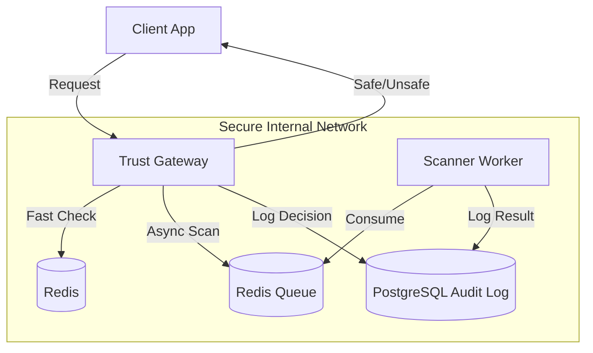

# AITrust Layer System Design

## 1. Problem Statement
As LLMs are integrated into critical applications, ensuring their safety, security, and reliability is paramount. Unchecked LLMs can leak PII, be manipulated via prompt injection, produce toxic content, or hallucinate facts. A dedicated "Trust Layer" is needed to govern interactions.

## 2. Objectives
- **Guardrails**: Enforce input/output safety policies (Toxicity, PII, Prompt Injection).
- **Observability**: Comprehensive audit logging of all interactions.
- **Latency**: Minimal overhead (< 100ms for critical checks).
- **Scalability**: Handle high throughput of requests asynchronously where possible.
- **Zero Trust**: Secure by design (AuthN/AuthZ, Network Isolation).

## 3. System Architecture (Distributed)
Following the `AIMemory` philosophy, we will use a distributed, async architecture.

### High-Level Components
1.  **Trust Gateway (FastAPI)**: Async REST API. Intercepts LLM requests/responses.
2.  **Policy Engine**: Logic to evaluate rules (Regex, Keyword, Model-based).
3.  **Scanner Service (Celery Workers)**: Runs heavy ML models (e.g., LlamaGuard, Presidio) for deep analysis.
4.  **Audit Store (PostgreSQL)**: Immutable log of all checks and results.
5.  **Cache (Redis)**: Caches frequent checks and acts as the Task Queue.

### Architecture Diagram


### Data Flow
1.  **Synchronous Check (Blocking)**:
    - Client sends text.
    - Gateway runs lightweight checks (Regex, Cache).
    - If safe, returns 200 OK. If unsafe, returns 400 Blocked.
2.  **Asynchronous Scan (Non-Blocking/Audit)**:
    - For heavy checks (e.g., Hallucination detection), Gateway returns immediately (optimistic) or waits (pessimistic) based on config.
    - Worker processes text with heavy models.
    - Updates Audit Log.

## 4. Data Model

### Audit Log
```json
{
  "id": "uuid",
  "request_id": "uuid",
  "timestamp": "datetime",
  "input_text": "string",
  "checks": [
    {
      "check_name": "pii_scanner",
      "status": "pass/fail",
      "score": 0.98,
      "latency_ms": 12
    }
  ],
  "verdict": "allow/block"
}
```

## 5. Security & Privacy (Zero Trust)
- **Authentication**: API Key (`X-API-Key`).
- **Network Isolation**: DB and Redis isolated.
- **Secrets**: Docker Secrets management.

## 6. Technology Stack
- **Language**: Python 3.10+
- **API**: FastAPI
- **Queue**: Redis
- **Worker**: Celery
- **Database**: PostgreSQL (Async)
- **ML**: `presidio-analyzer` (PII), `safetensors` (Guardrails).
