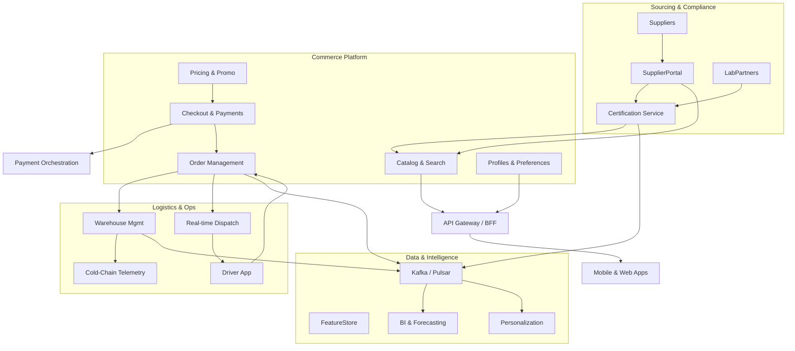

# HalalWeee — System Design (Halal E-Grocery Marketplace)

## 1. Vision & Value Proposition
- Deliver a “farm-to-home” halal grocery marketplace inspired by Weee, optimized for Muslim households that demand verified halal goods, prepared meals, and culturally relevant staples.
- Blend curated halal assurance (certifications, scholars, provenance) with the convenience of fast e-commerce logistics, community engagement, and discovery (recipes, events, bundles).
- Launch in North America (US/Canada) with regional expansion (UK/EU, MENA) once supply chain repeatable.

## 2. Core Requirements

### Functional
- **Discovery:** localized storefront, personalized recommendations, halal “trust badges”, advanced filtering (certification type, madhab, dietary tags, country of origin).
- **Inventory:** multi-warehouse fresh/frozen/ambient stock, preorder for specialty imports, drop-ship partner SKUs.
- **Compliance:** ingest and track halal certifications (e.g., IFANCA, HMC, MUI), automated expiry alerts, per-batch documentation, recall workflows.
- **Orders:** mobile/web checkout, multi-address, scheduled delivery windows, express <2h in dense metros, recurring subscriptions, group/community buys.
- **Payments:** cards, ACH, Halal BNPL partners, EBT/SNAP (phase 2), stored wallet & gift cards, referral credits.
- **Operations:** supplier onboarding, purchase planning, demand forecasting, cold-chain monitoring, driver routing, customer support (chatbot + human).
- **Community:** user reviews (certification-focused), recipe integrations, influencer campaigns, masjid deliveries, fundraising drives.

### Non-Functional
- **Availability:** 99.9% storefront & ordering; 99.5% logistics ops.
- **Latency:** <200 ms p95 for catalog/search within region; <500 ms for personalized feed.
- **Scale:** 500k MAU year 1, 50k peak DAU; 3k concurrent checkout sessions; 100k daily orders cross-region; inventory updates 50 TPS/warehouse.
- **Compliance:** SOC2 Type II, PCI DSS SAQ-D, GDPR/CCPA; halal cert data retention 7 years.
- **Freshness:** perishable inventory accuracy >98%; temperature telemetry every 5 minutes; halal certificate updates <1 hour of source change.

## 3. Personas & Journeys
- **Consumer (Sara):** browse halal meats, ready-to-cook kits, snacks; needs trust in sourcing, ability to filter by certification, schedule delivery.
- **Supplier (Halal Farm Co.):** uploads certification docs, manages SKUs, sets replenishment thresholds, views purchase orders.
- **Fulfillment Ops (Warehouse lead):** receives shipments, logs batch/lot, prints halal-compliant labels, monitors cold-chain, picks/packs orders.
- **Driver/Courier:** receives optimized routes, handles proof-of-delivery with tamper-seal validation.
- **Halal Compliance Officer:** audits certifications, tracks expirations, requests lab tests, manages recall bulletins.

## 4. Solution Overview



## 5. Service Responsibilities

### 5.1 API & Experience Layer
- **API Gateway/BFF:** GraphQL or REST; handles authentication, request shaping for mobile/web; orchestrates personalization; integrates with feature flags and A/B testing.
- **CMS/Content:** manages landing pages, promos, recipe articles; versioned with localization for EN, AR, FR, Urdu (phase 2).
- **Push & Notifications:** order lifecycle updates, delivery ETA, certificate renewal notices, Ramadan-specific campaigns.

### 5.2 Commerce Core
- **Catalog Service:** manages SKUs, bundles, variations; stores halal attributes (certifier, madhab compatibility, slaughter type, zabihah status), shelf-life metadata, allergen info. Utilizes ElasticSearch + vector search (taste similarity).
- **Inventory Service:** tracks stock per warehouse & drop-ship partner; supports FEFO (first-expire-first-out) logic for perishables; integrates IoT telemetry (temp excursions) to auto-hold affected lots.
- **Pricing & Promotions:** dynamic pricing based on demand, perishability windows, festival events (Ramadan, Eid); supports group purchase thresholds; ensures MAP compliance.
- **Order Management (OMS):** orchestrates order lifecycle (placed → allocated → picked → packed → dispatched → delivered); handles split shipments, substitutions, refunds, halal exception workflows.
- **Payment Orchestration:** integrates multiple PSPs, fraud screening (with halal-specific heuristics like masjid group orders), supports stored balance & referral credits; tokenizes cards, manages ACH micro-deposits.

### 5.3 Sourcing & Compliance
- **Supplier Portal:** onboarding forms, document uploads, digital signature of halal commitments, training modules; integrates with DocuSign and background checks.
- **Certification Service:** stores certification hierarchy (certifying body → certificate → SKU/lot); tracks validity dates; exposes APIs for UI badges; triggers alerts & takedowns when expired; integrates with blockchain/notary for tamper-proof records (phase 2).
- **Quality Assurance:** lab results ingestion, random sampling schedules, recall management; ensures non-halal contamination events escalate to incident room and customer notifications.

### 5.4 Fulfillment & Logistics
- **Warehouse Management (WMS):** inbound receiving, put-away, pick-pack-ship; supports temperature zones; manages halal separation (no cross-storage with non-halal). Integrates with handheld scanners.
- **Dispatch & Routing:** ETA predictions using traffic + driver availability; partners with gig fleets while ensuring halal handling training; supports curbside pickup and masjid drop-offs.
- **Driver App:** route manifests, temperature-check checklist, seal verification, photo proof-of-delivery, signature capture.
- **Cold Chain Monitoring:** IoT sensors streaming to MQTT/Kafka; anomaly detection to flag potential halal breaches (e.g., thaw-refreeze risk).

### 5.5 Intelligence & Analytics
- **Event Bus:** Kafka/Pulsar topics for orders, inventory, telemetry, certification updates, customer interactions.
- **Feature Store:** real-time features for recommendation (purchase recency, festival affinity), fraud detection.
- **Analytics/BI:** Snowflake/BigQuery; dashboards for GMV, conversion, wastage, certification health, supplier scorecards.
- **ML Services:** demand forecasting (seasonal/festival-aware), substitution suggestions, halal compliance risk scoring, personalized storefront ranking.

## 6. Data Model Sketches (POC)

```sql
CREATE TABLE halal_certifications (
  id UUID PRIMARY KEY,
  certifier TEXT NOT NULL,
  certificate_number TEXT,
  scope TEXT,                    -- e.g. slaughter, prepared foods
  issued_on DATE,
  expires_on DATE,
  document_url TEXT,
  status TEXT CHECK (status IN ('valid','pending','revoked','expired')),
  audit_notes TEXT
);

CREATE TABLE supplier_cert_links (
  supplier_id UUID REFERENCES suppliers(id),
  certification_id UUID REFERENCES halal_certifications(id),
  lot_number TEXT,
  sku_id UUID REFERENCES skus(id),
  valid_from TIMESTAMPTZ,
  valid_to TIMESTAMPTZ,
  PRIMARY KEY (supplier_id, certification_id, sku_id, lot_number)
);

CREATE TABLE inventory_lots (
  id UUID PRIMARY KEY,
  sku_id UUID REFERENCES skus(id),
  warehouse_id UUID REFERENCES warehouses(id),
  qty_on_hand INT,
  manufactured_on DATE,
  best_before DATE,
  certification_id UUID REFERENCES halal_certifications(id),
  temp_band TEXT,                 -- frozen, chilled, ambient
  status TEXT CHECK (status IN ('available','hold','quarantine','expired')),
  telemetry_alert BOOLEAN DEFAULT FALSE
);
```

## 7. Halal Trust & Compliance Controls
- **Certification Graph:** maintain mapping to recognized bodies; integrate APIs/web scraping to auto-refresh status; keep historical snapshots for audit.
- **Chain of Custody:** lot-level traceability from supplier to customer; tamper-proof sealing with QR codes linking to lot & certificate.
- **Operational SOPs:** enforce segregation (no pork/alcohol items anywhere); driver attestation flows; escalate any contamination alert to compliance officer.
- **Communication:** display certification details on product detail page; send proactive notifications for expiring certificates affecting subscriptions.
- **Incident Response:** automated recall workflow—hold inventory, cancel outstanding orders, notify impacted users, coordinate refunds & replacement credits.

## 8. Non-Functional Considerations
- **Scalability:** stateless microservices on Kubernetes; autoscale storefront & search; event-driven micro-batching for inventory projections.
- **Resilience:** multi-AZ deployments per region; read replicas for catalog; circuit breakers between OMS ↔ WMS; degrade gracefully (show “Halal badge verification delayed”).
- **Caching:** CDN (CloudFront/Akamai) for static/recipe assets; Redis for session, personalization precompute, certificate badge cache with TTL <1 hr.
- **Observability:** OpenTelemetry traces; log halal compliance actions separately; alerts on certificate expiry backlog, temperature excursions >5 min, order-to-dispatch SLA breaches.
- **Data Governance:** role-based access, least privilege; encrypt PII & financial data (KMS, HSM); maintain data residency for Canada/EU expansions.

## 9. Integration Landscape
- **External Providers:** PSPs (Stripe, Adyen), BNPL (Tabby/Tamara for MENA), address verification, SMS/email, map/routing (Google/Here), IoT telemetry vendors.
- **Marketplaces & Community:** social login (Apple, Google, Facebook), referral tracking, influencer affiliate links, masjid fundraiser APIs.
- **Regulatory:** FDA/CFIA import alerts, customs brokerage integration, halal certification APIs (IFANCA, HFA, MUIS).

## 10. Security & Privacy
- JWT + short-lived tokens for clients; rotating refresh tokens.
- MFA for supplier/compliance dashboards.
- Encrypt documents at rest, watermark certificates; monitor for abuse (forged documents).
- Continuous vulnerability scanning; penetration testing before expansion.
- PII minimization; allow guest checkout with email/phone; implement data deletion pipeline (GDPR, CCPA).

## 11. Build & Rollout Plan

### Phase 0 — Discovery (4-6 weeks)
- Validate supplier partnerships in 2 metros; build certification ingestion MVP; static storefront with curated catalog; manual order fulfillment with 3PL; capture customer support via shared inbox.

### Phase 1 — Pilot Launch (3 months)
- Deploy mobile-responsive web app + native iOS/Android shell (WebView).
- Implement core services: catalog, inventory, checkout, OMS, certification tracking, basic WMS integration.
- Launch single-region warehouse + darkstore; integrate Stripe + Halal BNPL; stand up call center/chat support with basic KB.
- Instrument analytics & alerts; run Ramadan/Eid campaign with curated bundles.

### Phase 2 — Scale & Automation (6-9 months)
- Multi-warehouse support, FEFO picking, IoT sensors, automated routing optimizations.
- Launch personalization, referral programs, group buys, community features.
- Add subscription boxes, catering, masjid fundraising deliveries; expand to Canada.
- Harden compliance (auto certificate refresh, lab integrations), implement cold-chain anomaly ML triggers, SOC2 certification.

### Phase 3 — Expansion (Year 2+)
- Launch marketplace for verified small vendors (dropship), integrate EBT/SNAP, partner with local halal restaurants.
- Roll out regional flavors (UK/EU) with localized compliance laws.
- Explore blockchain-backed certification notarization, AR in-app cooking guidance, embedded financing for suppliers.

## 12. Risks & Mitigations
- **Certification authenticity:** partner with recognized halal authorities, implement third-party audits, expose transparency dashboards.
- **Cold-chain failures:** redundant sensors, automated alerts, backup dry ice; real-time hold actions.
- **Supplier concentration:** diversify sourcing, maintain safety stock, support micro-suppliers via micro-fulfillment.
- **Seasonality spikes (Ramadan/Eid):** pre-build inventory projections, temporary dark stores, surge pricing guardrails.
- **Regulatory changes:** maintain legal counsel network, update compliance rules engine, subscriptions for FDA import alerts.

## 13. KPIs
- Order conversion rate, repeat purchase %, average delivery time, temperature breach incidents, certificate expiry SLA compliance, product return rate, NPS/CSAT, GMV per city, wastage %, community engagement (group buys, recipe views).

---

**Next Steps:** Align product/ops stakeholders on MVP scope, prioritize supplier onboarding pipeline, run technical spike for certification ingestion and cold-chain telemetry before committing to Phase 1 build.
