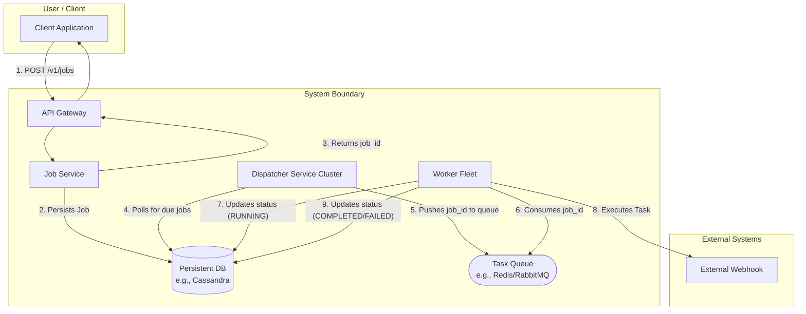

# Distributed Job Scheduler: System Design Document

Author: [Your Name]
Date: October 15, 2025
Version: 2.2 - Staff Level Review

1. Overview & Scope

This document proposes a system architecture for a highly available, scalable, and reliable job scheduler. The system is designed to handle millions of API requests for creating and managing both recurring (cron) and one-time (ad hoc) jobs.

The scope for the MVP is focused on three core functional requirements:

Job Creation: API-driven submission of jobs.

Reliable Execution: At-least-once execution semantics for scheduled tasks.

Job State Management: Tracking the lifecycle of a job.

2. High-Level Architecture

The system is designed as a set of distributed, decoupled microservices to ensure scalability and resilience. The core principle is to separate the job submission logic from the scheduling and execution logic.

Data Flow Summary:

Write Path: A client submits a job via the API Gateway. The Job Service validates it, persists it to the database, and returns a job_id.

Read/Scheduling Path: The Dispatcher service periodically queries the database for jobs that are due to be executed.

Execution Path: The Dispatcher places due jobs onto a Task Queue. A fleet of Workers consumes from this queue, executes the tasks, and updates the job status back in the database.

3. API Design

The API will be RESTful, accepting and returning JSON.

POST /v1/jobs

Creates and schedules a new job. This endpoint is idempotent. Clients should provide a unique Idempotency-Key in the header to safely retry requests without creating duplicate jobs.

Headers:

Idempotency-Key: <unique-uuid-per-request>

Request Body:

{
  "job_type": "ad_hoc", // "ad_hoc" or "cron"
  "execution_details": {
    "execution_time_utc": "2025-12-01T10:00:00Z", // For ad_hoc jobs
    "cron_expression": "0 5 * * *" // For cron jobs
  },
  "task": {
    "type": "http_callback",
    "url": "[https://api.example.com/webhook](https://api.example.com/webhook)",
    "method": "POST",
    "headers": { "Content-Type": "application/json" },
    "body": { "user_id": 123 }
  },
  "retry_policy": {
    "max_retries": 3,
    "backoff_strategy": "exponential"
  }
}

Success Response (202 Accepted):

{
  "job_id": "a1b2c3d4-e5f6-7890-1234-567890abcdef",
  "status": "SCHEDULED",
  "message": "Job accepted and scheduled."
}

GET /v1/jobs/{job_id}

Retrieves the current status and details of a job.

Success Response (200 OK):

{
  "job_id": "a1b2c3d4-e5f6-7890-1234-567890abcdef",
  "status": "COMPLETED",
  ...
}

4. Data Model and Database Design

4.1. Database Choice

A distributed NoSQL database like Apache Cassandra is the primary choice for its linear scalability and masterless architecture. Its high write throughput is ideal for our API-intensive service.

4.2. jobs Table Schema

CREATE TABLE jobs (
    job_id UUID,
    time_bucket TIMESTAMP, -- Partition key, e.g., truncated to the hour
    execution_time TIMESTAMP,
    status TEXT, -- SCHEDULED, QUEUED, RUNNING, COMPLETED, FAILED
    job_type TEXT, -- ad_hoc, cron
    cron_expression TEXT,
    task_payload JSONB,
    retry_policy JSONB,
    version INT, -- For optimistic locking
    created_at TIMESTAMP,
    updated_at TIMESTAMP,
    PRIMARY KEY ((time_bucket), execution_time, job_id)
) WITH CLUSTERING ORDER BY (execution_time ASC);

Key Design Choices:

Partition Key (time_bucket): This is critical for distributing the Dispatcher's load across the cluster, preventing hot partitions.

Clustering Key (execution_time): Sorts jobs by time within a partition, making the Dispatcher's query ...WHERE execution_time <= NOW() highly efficient.

5. Low-Level Deep Dive

5.1. Dispatcher: The Heartbeat of the System

The Dispatcher's main challenge is to find due jobs reliably without contention.

Problem: How do multiple Dispatcher nodes avoid picking up the same job?

Solution: Sharding and Distributed Locking.

A consistent hashing ring assigns each Dispatcher node a range of partitions (time_buckets) to poll.

When a Dispatcher queries a partition, it acquires a short-lived distributed lock (using ZooKeeper or etcd) on that time_bucket.

It then queries for due jobs, updates their status to QUEUED, and pushes them to the Task Queue before releasing the lock.

5.2. Worker Fault Tolerance: Leases

Problem: A Worker crashes while processing a job, leaving it stuck in a RUNNING state.

Solution: Job Leasing.

When a Worker picks a job, it acquires a lease by setting a lease_expires_at timestamp in the database.

The Worker must periodically heartbeat to extend the lease for long-running jobs.

A "Janitor" service periodically scans for jobs with expired leases and resets their status to SCHEDULED for re-execution.

6. Scalability, Availability & Fault Tolerance

(This section remains largely the same as it covers the core non-functional requirements)

Scalability: Stateless services (Job Service, Workers) are scaled horizontally. The database is scaled by adding nodes.

High Availability: All components run in a clustered, multi-AZ configuration with no single point of failure.

Fault Tolerance: Scenarios like node failures are handled by load balancers, lease expiration (for workers), and database replication.

7. Design Trade-offs and Alternatives

7.1. Write Path: Direct Database Write vs. Durable Queue

Our current design writes directly to the database from the Job Service.

Advantage: This provides lower latency for the client, as they receive confirmation that the job is durably persisted immediately. It also simplifies the architecture.

Alternative: An alternative is to use a durable message queue like Apache Kafka on the write path. The Job Service would publish the job to a Kafka topic, and a separate "Persister" service would consume from Kafka and write to the database.

Advantage of Alternative: This provides extreme write durability and can absorb massive, sudden spikes in traffic more gracefully than a database might.

Decision: For the MVP, the direct-to-DB approach is preferred for its simplicity and lower latency, especially since our choice of Cassandra is designed for high write throughput. We can re-evaluate and introduce a write-path queue if we observe database contention under extreme load.
