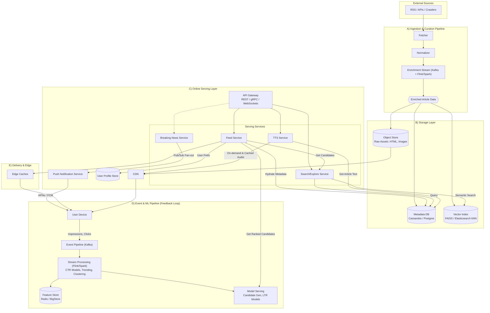

# Personal News Hub — System Design (EN/ZH, Multi‑Modal, Multi‑Million Scale)

## 1) Goals & Requirements

### Functional
- **Personal feed**: users select topics/interests; feed shows fresh items (text/video/audio).
- **Breaking news**: global (and regional) stream surfaced to all users regardless of interests.
- **Listen to news**: Text‑to‑Speech (TTS) for any article; queue/playlist; background play.
- **Multilingual v1**: **English & Chinese** UI/content; cross‑language recommendations.
- **Search & follow**: topics/entities/publishers; mute/block sources.
- **Feedback**: like/save/share/hide; “see less of this topic/source”.

### Non‑Functional
- **Scale**: multi‑million MAU, peak **100–200k QPS** feed reads, **10–20k QPS** event writes.
- **Latency**: p95 feed fetch < **200 ms** (cached); p95 TTS start < **1 s**.
- **Freshness**: breaking items visible < **5–10 s** from ingest.
- **Availability**: **99.9%+**; multi‑AZ; graceful degradation.
- **Compliance**: copyright, takedown, moderation, regional policies.

## 2) Workload Shape (Order‑of‑Magnitude)
- Users: **10M MAU**; DAU **3M**; CCU **300k**.
- Feed reads: **5/day/user** ⇒ **15M/day**; burst **150k rps**.
- Events (impressions, clicks, dwell): **60–150M/day**.
- Content ingest: **50k–200k items/day** (incl. short clips & podcasts).
- TTS requests: **0.5–1.5M/day** (≈3–10% of reads).

## 3) High‑Level Architecture


**Ingestion & Curation**
- **Fetcher**: RSS/APIs/crawlers/webhooks from publishers.
- **Normalizer**: text extraction, thumbnailing, video/audio manifest capture.
- **Enrichment (stream)**: language detect (EN/ZH), optional translation, **topic/entity tagging**, dedupe/cluster, NSFW/policy filter.
- **Storage**
  - **Object store** (S3/GCS): raw article HTML, images, video thumbs, audio.
  - **Metadata DB** (Cassandra/Scylla or Postgres + replicas): item metadata.
  - **Vector index** (FAISS/ScaNN/PGVector/Elastic kNN): multilingual embeddings.

**Online Serving**
- **API Gateway** (REST/gRPC) + **WebSocket** for breaking‑news push & audio control.
- **Feed Service**: candidate‑gen → rank → diversify; per‑user cache.
- **Breaking News Service**: editorial + algorithmic triggers; pub/sub fan‑out.
- **TTS Service**: on‑demand synth + cache; batch pre‑bake for top stories.
- **Search/Explore Service**: full‑text + semantic.
- **User Profile/Feature Store**: interests, follows, recency, language prefs.
- **Event Pipeline**: impressions/clicks/watch‑time → Kafka → streaming jobs → features/metrics.

**Data & ML**
- **Stream processing** (Kafka + Flink/Spark): CTR models, trending, dedupe/cluster, topic heat, real‑time features.
- **Feature Store** (Redis + BigStore): user/topic stats, recency, language counts.
- **Model serving**: ANN for candidates; LTR (XGBoost/LightGBM); bandits for exploration.
- **AB/feature flags**: Experiment platform.

**Delivery & Edge**
- **CDN** for images/video/audio/TTS.
- **Edge caches** for feed pages (keyed by user_id/cohort/interest hash).
- **Push notifications** (APNs/FCM) for breaking alerts & “listen later”.

## 4) Data Model (Simplified)

```sql
users(id, locale, region, created_at, ...)

interests(user_id, object_type['topic'|'publisher'|'entity'], object_id, weight, lang)

items(id, publisher_id, url_hash, title, summary, language, publish_ts,
      media_type['text'|'video'|'audio'], main_image_url, video_manifest_url,
      audio_url, source_cred, policy_flags, cluster_id)

item_topics(item_id, topic_id, score)
item_entities(item_id, entity_id, salience)

embeddings(item_id, vec)  -- multilingual (e.g., LaBSE/MiniLM)

tts_assets(item_id, voice, lang, audio_url, duration_s, status)

user_events(user_id, item_id, event['impression'|'click'|'dwell'|'finish_audio'|...], ts, meta)
```

## 5) Feed Generation (Ranking)

**Candidate Generation (high‑recall)**
- Topic follows ⇒ latest per topic (time‑decayed).
- Collaborative: “users like you” via ANN on user/item embeddings.
- Content‑based: cross‑lingual embedding ANN nearest neighbors.
- Publisher follows & region boosts.

**Filtering & Rules**
- Deduplicate by `cluster_id` (same story, different publisher).
- Language filter (respect user UI language; allow translated items).
- Safety/policy/blocked sources.

**Ranking (Learning‑to‑Rank)**
- Features: freshness, topic match, source quality, user‑item similarity, popularity, dwell‑time priors, language preference.
- **Diversity & recency constraints** (MMR/top‑K diversify; time windows).
- **Bandit exploration**: 5–10% explore budget for new sources/topics.

**Breaking News**
- Separate high‑priority queue; pinned to top for all users; also via WebSocket/push.
- Triggered by detectors (volume spike, authoritative flags) + editorial override.

## 6) Multilingual (EN/ZH)

- Language detection at ingest; store `language`.
- Cross‑lingual embeddings so CN content can match EN interests and vice versa.
- Optional translation for titles/summaries; retain original link.
- Chinese specifics: segmentation (jieba), normalized punctuation; pinyin synonyms for search.
- TTS voices: EN & ZH; auto‑select per item language; fallback to translated summary if needed.

## 7) TTS / “Listen” Architecture

- **On‑demand**: first tap triggers TTS; persist in `tts_assets`; serve via CDN; cache by `(item_id, voice, lang)`.
- **Pre‑bake**: top N items/hour per region to reduce cold starts.
- **Chapters**: split long reads; 1.5x/2x speeds; playlist & background play.
- **Edge caching**: HLS/DASH for long audio; HTTP range for MP3.

## 8) APIs (Sketch)

### REST
```
GET  /v1/feed?cursor=&lang=en&mode=personal|breaking
POST /v1/interests:upsert { topics:[...], entities:[...], publishers:[...] }
GET  /v1/item/{id}
GET  /v1/item/{id}/tts?voice=&lang=
GET  /v1/search?q=&lang=&type=item|topic|publisher
POST /v1/events  [{user_id,item_id,event,ts,meta}]
```

### WebSocket
```
WS   /v1/breaking/stream   -- server push of breaking headlines
```

Auth: OAuth/JWT. Rate‑limits per IP/user. ETags for feed caching. Cursors are opaque (item ids + rank position).

## 9) Storage & Caching

- **Hot feed cache**: Redis/KeyDB; per‑user feed pages (e.g., 50 items) materialized on first request or via background job; TTL 30–90s; incremental refresh.
- **Item cache**: Redis for item metadata by id; 95%+ hit rate.
- **Cold storage**: S3 for blobs; Glacier after N days.
- **Search**: OpenSearch/Elasticsearch bilingual analyzers; kNN plugin for vector search (or PGVector).

## 10) Eventing & Models

- **Kafka topics**: `ingest_raw`, `items_norm`, `items_enriched`, `events_impressions`, `events_clicks`, `rank_features`, `trending`.
- **Flink/Spark** jobs: CTR priors by (topic, source, language), user recency vectors, trending/cluster heat, suppression lists.
- **Model updates**: daily batch for LTR; hourly warm‑start; online features in Redis.

## 11) Content Safety & Rights

- Publisher allow‑list + robots/policy respect; signature verification for API feeds.
- Moderation: NSFW/violence classifiers; geo‑policy flags; takedown pipeline; audit log.
- Copyright: store source metadata; canonical links; honor `noaudio`/`norepublish` flags; TTS only for licensed partners if required.

## 12) Observability & SRE

- **Golden signals**: feed p95 latency, freshness lag (ingest→visible), TTS cold‑start rate, CTR, dwell, breaking fan‑out lag, cache hit ratios, error rates.
- **Tracing**: request → feed service → ranker → caches → DB.
- **Dashboards/alerts**: ingest backlog, model lag, spike detectors, CDN errors, translation/TTS error budgets.

## 13) Capacity & Scaling

- Stateless API; autoscale on CPU/QPS.
- Redis cluster for feed & feature caches (tens of millions of keys).
- Kafka 3–5 brokers to start; partition by `item_id`/`user_id`.
- DB: start Postgres + read replicas; migrate items to Cassandra/Scylla beyond 100M rows & high write throughput.
- CDN offloads media; pre‑signed URLs for origin.

## 14) Failure Modes

- Ingest outage → show cached feeds; indicate “Older stories”.
- Ranker/model unavailable → fallback heuristic (freshness + topic).
- TTS provider down → disable listen button, serve pre‑baked assets only.
- Redis miss → warm on demand; degrade to DB + minimal ranking.

## 15) Security & Privacy

- PII minimal; consent for personalization; “No personalization” mode (contextual only).
- GDPR/CCPA deletion pipelines.
- Abuse controls: spam sources, click farms, bot detection; per‑user/AS rate limits.

## 16) Build Plan

### Phase 0 (2–3 weeks, POC)
- Minimal ingest (RSS/APIs for 50–100 publishers); normalize + topic tagging.
- Personal feed: interests → candidate (topic, recency) → heuristic rank.
- Breaking news: manual + basic trending (spike on mentions).
- TTS: on‑demand via managed TTS (EN/zh‑CN); cache to S3 + CloudFront.
- Storage: Postgres (items, users, interests), Redis (feed cache), S3.
- Client: Web SPA (Next.js) with EN/中文 toggle; audio player; WebSocket breaking ticker.

### Phase 1
- Kafka pipeline; embeddings + ANN candidate gen; simple LTR; SSE/Push; iOS/Android.

### Phase 2
- Full model loop, translation at scale, publisher portal, moderation console, advanced analytics.

## 17) Minimal Schemas (POC: Postgres)

```sql
CREATE TABLE users(
  id BIGSERIAL PRIMARY KEY,
  locale TEXT,
  region TEXT,
  created_at TIMESTAMPTZ DEFAULT now()
);

CREATE TABLE interests(
  user_id BIGINT REFERENCES users(id),
  type TEXT,              -- 'topic'|'publisher'|'entity'
  object_id TEXT,
  weight REAL,
  lang TEXT,
  PRIMARY KEY(user_id, type, object_id)
);

CREATE TABLE items(
  id BIGSERIAL PRIMARY KEY,
  url TEXT UNIQUE,
  title TEXT,
  summary TEXT,
  language TEXT,
  media_type TEXT,        -- 'text'|'video'|'audio'
  publish_ts TIMESTAMPTZ,
  main_image_url TEXT,
  video_manifest_url TEXT,
  audio_url TEXT,
  cluster_id TEXT,
  policy_flags INT DEFAULT 0
);

CREATE TABLE item_topics(
  item_id BIGINT REFERENCES items(id),
  topic_id TEXT,
  score REAL,
  PRIMARY KEY(item_id, topic_id)
);

CREATE TABLE tts_assets(
  item_id BIGINT REFERENCES items(id),
  lang TEXT,
  voice TEXT,
  audio_url TEXT,
  duration_s INT,
  status TEXT,            -- 'ready'|'processing'|'failed'
  PRIMARY KEY(item_id, lang, voice)
);
```

## 18) Sample Endpoints (POC)

- `POST /interests` — upsert interests  
- `GET /feed?lang=en` — cached page or compute (topic candidates + recency rank)  
- `GET /item/{id}/tts?lang=zh` — returns MP3 URL; triggers synth if missing  
- `WS /breaking` — ticker `{id,title,url,lang}`

## 19) Ranking Heuristic (POC)

```text
score = w1 * freshness_decay(hours) +
        w2 * topic_overlap(user, item) +
        w3 * source_quality(item.publisher) +
        w4 * popularity(item.cluster_heat)
```
Dedupe by `cluster_id`, ensure language match, and include 1–2 explore items per page.

---

**Notes**
- EN/中文 UI copy: store i18n strings; surface mixed‑language content when the user opts in.
- Rights/licensing: maintain per‑publisher policies for audio/translation/reuse.
- Future: entity‑centric feeds (companies, people), newsletters, summaries, RAG over user‑saved items, and on‑device TTS for mobile offline mode.
