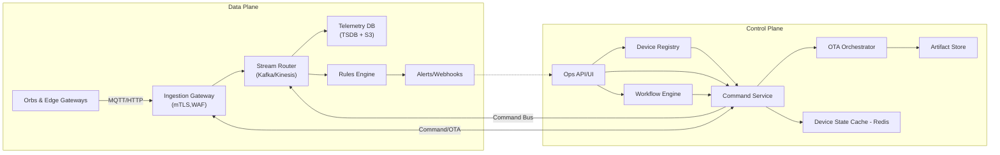

# OrbManager - Cloud Fleet Management Platform Design

## 1. Problem Statement
OrbManager is a multi-tenant, cloud-native control plane that manages fleets of distributed smart hardware endpoints ("orbs" / robotaxis). The platform must admit heterogeneous device types, orchestrate continuous telemetry ingestion, push control commands and software updates, and provide real-time health visibility while remaining highly available, horizontally scalable, and fault tolerant across cloud regions.

## 2. Key Requirements & Assumptions
### Functional
1. **Device Lifecycle**: secure onboarding/provisioning, attribute management, firmware/AI model version tracking, decommissioning.
2. **Telemetry & Alerts**: ingest high-volume status/metrics + geospatial data, persist time-series, evaluate rules or ML anomaly detectors, trigger alerts/webhooks.
3. **Command & Control**: enqueue targeted/broadcast commands, guarantee at-least-once delivery with idempotent execution acks, optional expiry windows.
4. **OTA Updates**: staged firmware/model rollout, canary cohorts, rollback, bandwidth throttling.
5. **Fleet Visibility**: search/filter orbs, show live location, historical playback, battery/mission stats dashboards.
6. **Workflow Automation**: user-defined policies (e.g., auto-park low-battery orb) via low-code workflows integrating external systems.
7. **Multi-Tenancy & RBAC**: tenant isolation, org hierarchy, fine-grained roles, audit logging.
8. **Integrations & APIs**: public APIs/webhooks, event streams for downstream analytics, support offline batch export.

### Non-Functional
- 99.95% regional availability; RPO<=5 min, RTO<=15 min.
- Telemetry ingestion P95 < 1 s end-to-end from device to dashboard; alerts <5 s.
- Support fleets up to 500K active orbs, each streaming 1 KB payload every 2 s (~250 MB/s aggregate).
- Zero data loss for commands and OTA rollouts; commands must be durable and traceable.
- Compliance: data encryption, device identity attestation, audit trails, GDPR/CCPA readiness.

### Assumptions
- Devices run OrbOS agent supporting MQTT over TLS + HTTP fallback; intermittent connectivity expected.
- Reference cloud: AWS multi-region (primary us-east-1, secondary us-west-2) with private connectivity to manufacturing facilities.
- Fleet operations team uses OrbManager console + APIs; third-party systems may subscribe via EventBridge/Kinesis.

### Out of Scope (initial release)
- On-device autonomy algorithms (handled by orb firmware).
- Human-in-the-loop teleoperation UI.
- Long-term cold storage analytics lake build-out (only S3 raw dumps now).

## 3. High-Level Architecture

**Control Plane Services** (stateless, autoscaled): API Gateway, Device Registry Service, Command Service, OTA Orchestrator, Workflow Engine, User/Tenant Service. They rely on managed data stores (Aurora PostgreSQL for metadata, DynamoDB for hot state, Redis for low-latency caches) and stream backbone (Kafka/Kinesis) for telemetry/commands/events. The Ops API/UI and workflow automation surface sit entirely in this plane.

**Data Plane**: Device agents publish/consume via MQTT topics partitioned by tenant/device; messages flow through the Ingestion Gateway, stream router, and durable telemetry stores. This plane prioritizes low-latency, high-throughput handling of orb traffic, supports fan-out to rules/alerting, and back-propagates results (commands, OTA payloads) through the gateway for device consumption.

## 4. Data Model Overview
| Domain | Store | Key Entities |
| --- | --- | --- |
| Device metadata | Aurora Postgres | `tenants`, `orbs`, `orb_attributes`, `firmware_versions`, `certificates` |
| Operational state | DynamoDB | `orb_state` (last heartbeat, battery, mode), `command_state`, `ota_batches` |
| Telemetry | Timestream/ClickHouse + S3 | `metrics` table partitioned by tenant+orb, raw payloads in S3 parquet |
| Commands | Kafka topic + DynamoDB | Topic `command.dispatch` (pending), `command.ack`; DynamoDB for durable status |
| Alerts/Events | Kafka/EventBridge + S3 | Derived events for workflows, persisted for audit |

## 5. Key APIs (REST/gRPC)
- `POST /v1/orbs/register`: supply CSR + metadata, returns device_id + credentials, triggers certificate issuance via AWS IoT + KMS.
- `GET /v1/orbs?tenant_id=&status=`: search/filter with pagination.
- `POST /v1/orbs/{id}/commands`: payload includes `command_type`, `payload`, `expiry_ts`, `idempotency_key`.
- `GET /v1/orbs/{id}/commands?status=pending`: returns outstanding commands + sequence numbers.
- `POST /v1/orbs/{id}/telemetry`: HTTP fallback ingestion (main path is MQTT topic `telemetry/{tenant}/{orb}`).
- `POST /v1/ota/campaigns`: define rollout cohorts, FW artifact references.
- `POST /v1/alerts/rules`: configure conditions leveraging telemetry fields.
- Webhooks: `orb.alert.triggered`, `orb.flight.completed`, `ota.stage.progress`.

## 6. Scaling & Fault Tolerance Strategies
1. **Multi-AZ + Multi-Region**: All stateless services deployed on EKS/AKS with autoscaling, cross-region active/active for read APIs; command/telemetry topics mirrored with Kafka MirrorMaker or Kinesis multi-region replication. Aurora Global Database provides async replica; writes primarily in region A with failover playbook.
2. **Backpressure & Rate Limiting**: Ingestion layer enforces tenant/device quotas; if Kafka lag builds, drop non-critical metrics, keep health heartbeats. Device agent caches commands + telemetry for up to N minutes when offline.
3. **Exactly-once semantics (effective)**: Use sequence numbers + idempotency keys; command service uses Dynamo conditional writes to ensure single execution record. Telemetry storage is append-only; dedupe on query using message_id.
4. **Circuit Breaking & Retries**: gRPC clients use exponential backoff; ingestion gateway stores telemetry in local RocksDB when downstream unavailable.
5. **Disaster Recovery**: Frequent snapshots of metadata DB to S3; IaC (Terraform/CloudFormation) for rebuild; run chaos tests quarterly.

## 7. Observability & Ops
- OpenTelemetry tracing from gateway to DB writes.
- Metrics: ingestion QPS, command delivery latency, OTA success %, per-tenant usage, workflow engine throughput.
- Logs centralized in OpenSearch; device-level logs accessible via secure tunnel.
- On-call automation uses runbooks, PagerDuty, auto-remediation Lambdas.

## 8. Security & Compliance
- Mutual TLS with hardware-backed device certificates; cert rotation automated.
- Device attestation via TPM/TEE challenge; firmware signed + verified before boot.
- Secrets stored in AWS Secrets Manager; KMS CMKs per tenant optional.
- RBAC + ABAC; integration with SSO (SAML/OIDC) and SCIM provisioning.
- Audit logging immutably stored in AWS QLDB or append-only S3 bucket with object lock.

## 9. Roadmap & Enhancements
- **Phase 2**: Digital twin simulation service, teleoperation integration, predictive maintenance ML models.
- **Phase 3**: Edge mesh networking, AI copilots for fleet ops.

## 10. Proof-of-Concept (POC) Scope
To validate core concepts, the POC will deliver:
- FastAPI-based control plane with SQLite persistence for tenants/orbs/telemetry/commands.
- MQTT-like behavior simulated via REST endpoints (`/telemetry`, `/commands/ack`).
- Simple rule engine that flags low-battery telemetry and creates alert records.
- Background scheduler processing pending commands and expiring them.
- CLI/demo script to register orbs, push telemetry, issue commands, and observe state changes.

Limitations: single-node deployment, no actual MQTT, no OTA artifacts, minimal auth.
