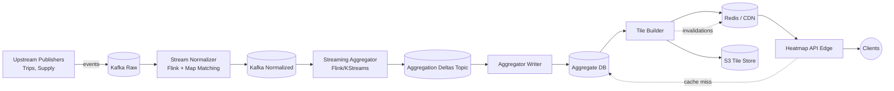

# Uber Demand Heatmap Service Design

## Problem Statement
Product and operations teams need a near-real-time view of rider/driver demand to rebalance supply, price rides, and highlight surge areas in the consumer apps. We must ingest millions of geo-tagged events per minute, aggregate them into geospatial buckets, and serve multi-zoom heatmap tiles within ~500 ms end-to-end latency while maintaining high availability worldwide.

## Goals
- **Real-time demand view**: Under 5 second end-to-end delay from event ingestion to tile availability.
- **Multi-resolution heatmap**: Support zoom levels 4–18 with smooth transitions between tiles.
- **Global scale**: Handle >10M events/min with regional redundancy.
- **Low-latency reads**: 99th percentile tile fetch <150 ms (from edge) for mobile clients and ops dashboards.
- **Multi-tenant consumers**: Pricing, driver operations, supply forecasting, experimentation.

## Non-Goals
- Historical interactive analytics (handled by data warehouse). We expose summaries for ≤24h.
- Client-side geo-visualization beyond heatmaps (e.g., trajectories).
- Driver/rider notification logic; we only provide heatmap data.

## Assumptions
- Events include ride requests, driver pings, trip starts/completions with GPS coordinates, timestamps, and metadata.
- We rely on Uber's existing Kafka backbone for event transport and Flink/Spark streaming clusters regionally.
- We can reuse shared S2/Quadkey geo-index libraries.
- Data residency requirements mandate EU data stays in-region; heatmap service is regionally deployed with optional cross-region replication of aggregates.

## Primary Use Cases
- Ops dashboard renders heatmap overlays to adjust incentives.
- Rider app overlays demand surge areas.
- Pricing service consumes aggregated demand/supply ratios per cell for surge calculation.
- Alerting systems detect anomalies (demand spikes, supply drop-offs).

## Functional Requirements
- Ingest real-time location events from multiple upstream publishers.
- Deduplicate and validate events (GPS jitter, outliers).
- Aggregate counts/metrics per geospatial cell and per time window (1 min, 5 min, 15 min rolling windows).
- Persist aggregates for at least 24h, expose retrieval by region/zoom/time window.
- Serve heatmap tiles (JSON/Protocol Buffers) and vector tile overlays.
- Provide APIs to fetch summary statistics for internal services.
- Support backfilling from event logs in case of gap.

## Non-Functional Requirements
- Availability ≥99.9%.
- Latency: ingestion pipeline processing <2s; cache hit tile response <150 ms.
- Horizontal scalability: automatic scaling with event volume growth.
- Strong data privacy controls (PII stripped).
- Observability: metrics, distributed tracing, data quality monitors.

## External APIs
- **Heatmap Tile API** (HTTP GET via CDN): `/tiles/{layer}/{z}/{x}/{y}?time_range={current|lookback}&agg={demand|supply|ratio}`
  - Returns Protocol Buffer payload with cell intensity values + metadata (`generated_at`, `window`).
- **Aggregate Query API** (gRPC): `GetAggregate(RegionId, TimeWindow, ZoomLevel)` for internal consumers (pricing, alerts).
- **Admin APIs** (authenticated): manage layer configurations, override thresholds, trigger backfills.

## Data Model
- **Raw Events**: `event_id`, `event_type`, `timestamp`, `lat`, `lon`, `driver_id?`, `rider_id?`, `city_id`, `metadata`.
- **Normalized Event Stream**: enriched with map-matched coordinates, dedupe flag, computed `s2_cell_id` at multiple levels (e.g., level 10–16).
- **Aggregate Store**:
  - Key: `(layer, zoom_level, tile_id, window_start_epoch)`
  - Values: counts (`demand_count`, `supply_count`), `ratio`, `confidence_score`, `last_updated`.
  - Stored in columnar (Cassandra/Scylla) or time-series DB (ClickHouse) optimized for range scans per tile/time window.
- **Tile Cache Entry**: serialized tile payload + TTL metadata.

## Architecture Overview
1. **Ingestion Layer**: Upstream services publish ride/driver events into Kafka topics partitioned by city/region.
2. **Stream Normalizer**: Flink job consumes, deduplicates by event_id, applies map matching, calculates S2 cell IDs at multiple zoom levels, and emits normalized events downstream. Emits to a regional Kafka topic.
3. **Aggregator (Streaming)**:
   - Stateful Flink/Kafka Streams job groups by `(layer, s2_cell_level, s2_cell_id, window)` using tumbling windows (1, 5, 15 minutes). Maintains sliding state with RocksDB.
   - Emits incremental updates (delta counts) to an **Aggregation Topic**.
4. **Aggregator Writer**:
   - Microservice consumes aggregation deltas, writes to aggregate store (Cassandra/Scylla or DynamoDB equivalent) with idempotency (upsert by key, accumulate counts).
   - Publishes change notifications to **Tile Update Topic**.
5. **Tile Builder Service**:
   - Subscribes to tile updates, groups updates per tile, materializes serialized tile payload (vector tile or JSON heatmap) and stores in Redis/Memcached cluster and S3/GCS for archival.
   - Pushes invalidation messages to CDN edge cache.
6. **Heatmap API**:
   - Edge service with global Anycast, handles tile requests, checks in-memory/L2 cache (Redis), falls back to aggregate store for regeneration if missing.
   - Applies rate limiting, authentication/authorization for internal tools.
7. **Offline Backfill**:
   - Batch Spark job can replay event logs to recompute aggregates, writing directly to aggregate store and notifying tile builder.

## Architecture Diagram
```
         +----------------------+        +-----------------------+
         | Upstream Publishers |        | Rider / Driver Apps   |
         | (Trips, Supply, etc)|        | Ops Dashboards        |
         +----------+----------+        +-----------+-----------+
                    |                               |
                    v                               |
            +---------------+                       |
            | Kafka (Raw)   |<----------------------+  Tile fetch via CDN
            +-------+-------+                           (HTTP/Protobuf)
                    |
                    v
          +--------------------+
          | Stream Normalizer  |
          | (Flink, map match) |
          +--------+-----------+
                   |
                   v
            +--------------+
            | Kafka (Norm) |
            +------+-------+
                   |
                   v
        +-----------------------+
        | Streaming Aggregator  |
        | (Flink/Kafka Streams) |
        +-----------+-----------+
                    |
                    v
         +--------------------------+
         | Aggregation Deltas Topic |
         +------------+-------------+
                      |
                      v
           +------------------------+
           | Aggregator Writer      |
           +------+-----------------+
                  |
          +-------+--------+
          | Aggregate DB   |
          | (Cassandra)    |
          +-------+--------+
                  |
                  v
          +-----------------+          +-----------------+
          | Tile Builder    +--------->| Redis / CDN L1  |
         +--------+--------+   push   +--------+--------+
                   |                         |
                   v                         v
           +---------------+        +--------------------+
           | S3 Tile Store |        | Heatmap API (Edge) |
           +---------------+        +---------+----------+
                                              |
                                              v
                                         +----------+
                                         | Clients  |
                                         +----------+
```



## Data Flow
1. Event generated (e.g., rider opens app) → Kafka `ride-events` (~10M/min).
2. Stream Normalizer cleans data, outputs `normalized-events` (S2-coded).
3. Streaming Aggregator maintains per-cell counts for each window and push deltas every 30 seconds.
4. Aggregator Writer persists to multi-region Cassandra (primary + follower).
5. Tile Builder updates Redis hot cache, S3 cold storage, and invalidates CDN tile.
6. Client requests tile → CDN (cache hit) → origin (Heatmap API) if miss → Redis (L2) → Cassandra (L3) → rebuild tile if needed.

## Geospatial Indexing & Partitioning
- Use **S2 cells** to align with Uber's existing geospatial infrastructure.
- For each zoom level, compute the corresponding S2 level (e.g., zoom 10 ≈ S2 level 10). Aggregate per level to avoid expensive roll-ups at read time.
- Partition Kafka topics by `city_id` + `s2_cell_level` to balance load.
- Cassandra table partition key: `(region, s2_level, tile_id)` with clustering on `window_start_epoch`. TTL aggregates after retention period.

## Consistency & Freshness
- Writers follow at-least-once; ingestion dedupe ensures idempotency.
- Aggregator outputs deltas with sequence numbers; writer performs idempotent updates using `IF last_seq_id < incoming_seq_id`.
- Heatmap tiles carry `generated_at` timestamps; clients discard stale tiles.
- For cross-region replication, use asynchronous Multi-DC replication; remote reads fall back to nearest region, accepting eventual consistency (<5s).

## Caching Strategy
- **CDN Layer (L0)**: Cache static tiles per time window (cache key includes window start). Short TTL (30–60s).
- **Edge Redis (L1)**: Stores hot tiles for 5 minutes to absorb misses.
- **Origin Memory (L2)**: Heatmap API caches recently served tiles in process (LRU).
- **Rebuild triggers**: On receiving update message, Tile Builder pushes invalidation to CDN + Redis to avoid stale data.

## Fault Tolerance & Recovery
- Kafka with replication factor ≥3; Flink checkpoints to DFS (HDFS/S3) for state recovery.
- Aggregator Writer retries with exponential backoff and DLQ for poison messages.
- Tile Builder stateless; multiple replicas behind load balancer.
- Cassandra multi-region with automatic failover; local reads preferred.
- Backfill job can heal gaps by replaying event logs for missing windows.

## Data Quality & Observability
- Metrics: events/min, dedupe rate, aggregation latency, tile build latency, cache hit ratios, tile freshness (seconds).
- Alerts on stale tiles (no update in 5 min), ingestion lag, high error rates.
- Sampled tracing for request path (Heatmap API).
- Data validation: assert counts within expected bounds, compare streaming vs batch aggregates nightly.

## Security & Privacy
- Strip PII before normalizer output (remove rider/driver IDs or hash).
- All APIs require mTLS (internal) or OAuth for admin clients.
- Rate limits per client; audit logs for admin overrides.
- GDPR compliance: enforce data retention, allow per-region residency.

## Capacity Planning
- Assume 10M events/minute peak, average payload 200 bytes → 33 MB/s per region.
- Streaming cluster sized for 2× headroom; aggregator state ~20 GB per region (S2 level 14 * windows).
- Redis sized for top 1M tiles (~2 KB each ≈ 2 GB) with sharding.
- Cassandra tuned for write-heavy workload; compaction strategy `DateTiered` or `TimeWindowCompaction`.

## Deployment & Rollout
- Separate clusters per region (NA, EU, APAC) with blue/green deployments.
- Feature flags control tile exposure to clients; ability to fall back to stale data.
- Rollout order: internal ops dashboard → limited driver/rider experiments → full rollout.
- Chaos testing for Kafka/Flink node failure, Cassandra region failover.

## Future Enhancements
- Integrate predictive model outputs (future demand estimates) as separate layers.
- Expose historical archive in cold storage for BI tools.
- Add client-specific down-sampling to reduce payload size on low bandwidth.
- Support adaptive grid resolution (merge sparse cells automatically).
